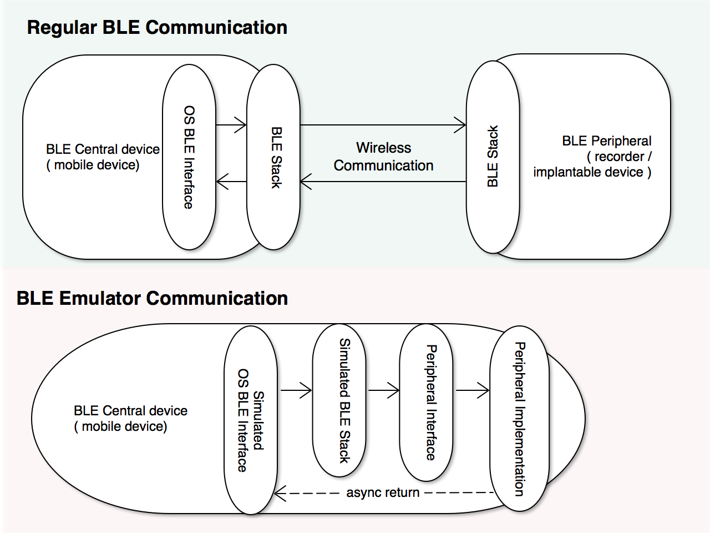
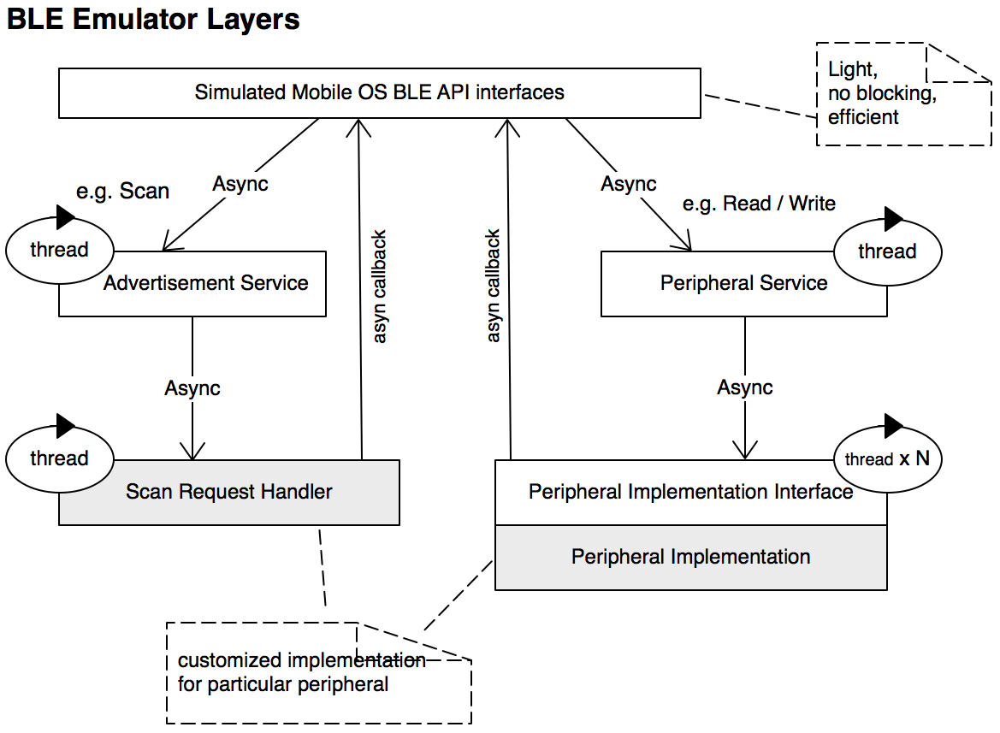
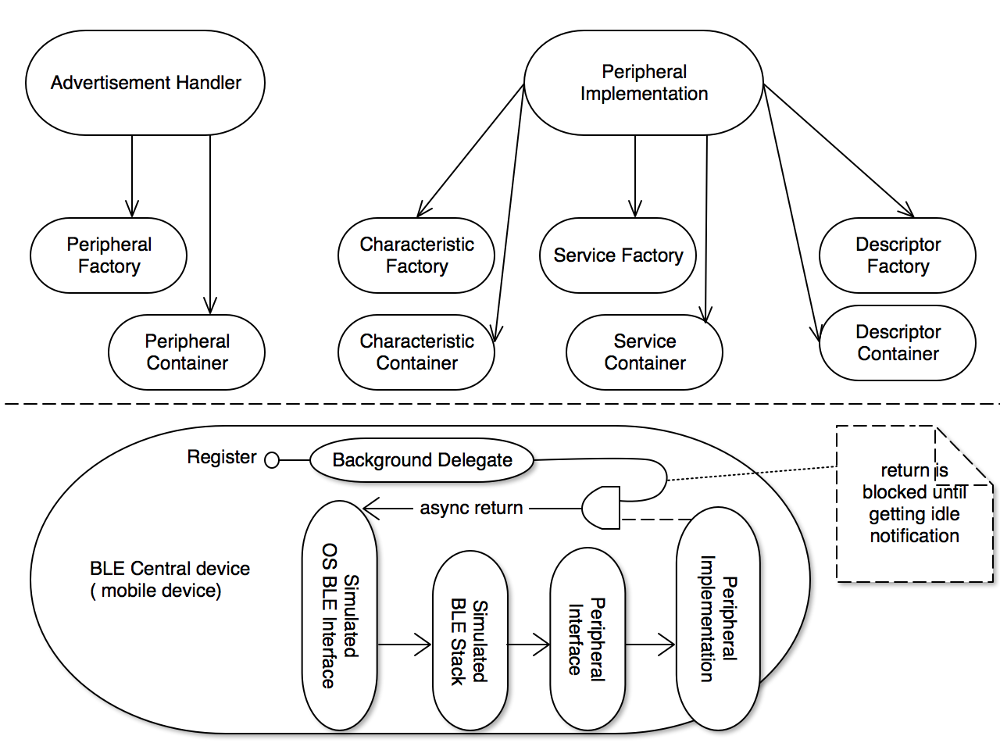

# Design of BLE Simulator

The design in this document applies to both iOS and Android Simulators unless otherwise specified.

# High Level Design

All simulator code is behind the simulated Mobile BLE interface. Caller, namely mobile application, will only see same BLE interface as native BLE.

# Benefit of Software BLE Simulator
* Since the simulated BLE peripheral code/logic runs inside same process as application, very easy to control and synchronize the peripheral behavior, which facilitates the automatic test.

* When the simulated peripheral logic runs together as part of application, no wireless communication and mobile OS interaction, it allows to simulate different error & end cases. It is also able to simulate timing conditions easily, e.g. when reading is returned. It definitely allows step by step debugging without connection timeout.

* By simulating exact mobile OS BLE interface, mobile application needs very limited code change to switch between real BLE and this simulated BLE library.

* BLE simulator is able to simulate background BLE behavior. This is a big benefit for testing since background BLE behavior highly relies on mobile OS scheduling, hard to predict.

* The code of BLE simualtor is neutral and independent from particular project, it can be used by other projects. 

# Middle Level Design

Behind the simulated Mobile native BLE interface, two services are responsible for BLE request before and after the connection establishment.

To keep simulated mobile BLE interface efficient, the interface layer just puts BLE request in a queue and returns immediately. The two services run asynchronously from the BLE interface and pull BLE request from queue to process.

The gray blocks in the diagram show where project particular peripheral logic inhabits. A user of the BLE simulator library should only change/add logic in these gray area.

Since the BLE callback function by caller is unknown for BLE simulator, the code in two gray blocks runs asynchronously from the callback function with exception catcher which guards the issues thrown from user's BLE callback.

# Low Level Design

This diagram shows some of low level design.

Here are some low level design consideration. Will update periodically:

 - Use containers for peripheral, service, characteristic and description object.
 - Avoid keeping strong reference besides the container. 
 - Background mode suspends peripheral callback until condition is satisfied.
 - Pass UUID internally instead of object e.g. characteristic object.
 - Package internal sub-class has more capability

 